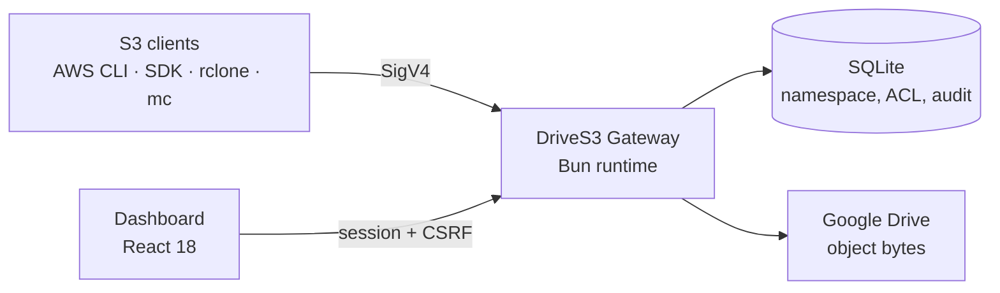

<div align="center">

# DriveS3 Gateway

**Your Google Drive, speaking fluent S3.**

Point the AWS CLI, an AWS SDK, rclone, or MinIO `mc` at your own domain.
Objects land as real files in Google Drive, while SQLite keeps the S3
namespace honest.


</div>

## How it works



Every user acts through their own Google OAuth grant. There is no
service-account backdoor into anyone's Drive, and buckets live either in the
owner's **My Drive** or in an explicitly chosen **Shared Drive**, with per-user
Viewer/Editor access.

## Contents

- [Highlights](#highlights)
- [Compatibility](#compatibility)
- [Quick start](#quick-start)
- [Google OAuth setup](#google-oauth-setup)
- [Optional: virtual-hosted endpoint](#optional-virtual-hosted-endpoint)
- [Drive API quota](#drive-api-quota)
- [Dashboard](#dashboard)
- [Quality gates](#quality-gates)
- [Production deployment](#production-deployment)
- [Backup and restore](#backup-and-restore)
- [Architecture constraints](#architecture-constraints)
- [Further reading](#further-reading)

## Highlights

### Security

| | |
|---|---|
| **Two-factor auth** | TOTP enrollment by QR or manual key, single-use recovery codes, and a pending-session gate that blocks the API until the code clears. Verified against the RFC 6238 test vectors. |
| **Scoped login** | Google OAuth gated by Workspace domain and/or an explicit email allowlist, so personal Gmail can be admitted deliberately. |
| **Secrets at rest** | Refresh tokens, TOTP secrets, and backups are AES-256-GCM encrypted with per-context AAD. Recovery codes are stored only as hashes. |
| **Request hardening** | Session and CSRF protection, SigV4 header plus presigned-query auth, security headers, bounded request bodies, and per-scope rate limits. |
| **Encryption at rest** | Optional server-side encryption per bucket or per object: SSE-S3, SSE-KMS with your own customer master keys, or SSE-C. Ranged reads stay cheap, since the cipher is seekable. |
| **Retention** | Object Lock in GOVERNANCE or COMPLIANCE mode, plus Legal Hold. A COMPLIANCE lock cannot be lifted by anyone, including the bucket owner. |

### S3 data plane

- Path-style CRUD, `ListObjectsV2`, bulk delete, byte-range GET, and
  conditional GET (`If-Match`, `If-None-Match`, `If-Modified-Since`).
- Full multipart upload lifecycle, `CopyObject`, and `UploadPartCopy` — copies
  may be ranged, conditional, versioned, or across two different owners.
- Object versioning with delete markers and undelete.
- ACLs and bucket policies, including anonymous public access when a policy
  or ACL grants it (and `S3_ALLOW_ANONYMOUS=false` to forbid it outright).
- SigV4, SigV4A, presigned URLs, and PresignedPost browser form uploads.
- Optional virtual-hosted addressing (`{bucket}.{domain}`) alongside the
  always-on path-style default.
- Streaming resumable uploads, atomic overwrite, a durable cleanup queue, and
  reconciliation against Drive.

### Dashboard

- **Objects and buckets:** streaming upload, preview, download, delete,
  temporary presigned links, revocable public links, browser upload forms,
  cross-bucket copy, and per-object version history.
- **Access control:** canned ACLs and a bucket policy editor, with a badge on
  any bucket reachable by the anonymous public.
- **Encryption keys:** create, rotate, and disable customer master keys.
  Rotation never strands data — objects record the key version they were
  written under.
- **Credentials:** create, atomic rotate, revoke, and permanently delete
  (revoked keys only), with a one-time download of the new secret.
- **Drive import:** copy an existing Google Drive folder tree into a bucket as
  a one-time, read-only snapshot.
- **Drive API quota:** how much Google Drive API quota is left, read live from
  Google rather than estimated, alongside the calls this gateway actually made.
- **Traffic charts:** bandwidth, request count, and error count over 1h, 24h,
  or 7d, refreshing every 15s, both dashboard-wide and per bucket.
- **Activity log:** cursor-paginated audit trail of control-plane actions.
- **Made to fit:** Indonesian and English throughout, light and dark themes,
  and a color theme picker with custom accent support.

### Multi-drive backup

Link a second Google account (a personal Gmail, for example) as a backup
target, then run a manual per-bucket transfer. Objects are copied into a
folder of their own on that account, source files are never modified, and a
durable per-object ledger means repeat runs skip anything unchanged. The
design is deliberately scheduler-ready.

### Admin settings

Google OAuth client credentials and the Drive root folder name are editable at
runtime from the dashboard, so rotating them no longer means redeploying with
new environment variables.

## Compatibility

This is not a reimplementation of all of Amazon S3, but every feature listed
below is backed by a passing test — the dashboard ships an evidence-based
compatibility matrix, and a row cannot be marked supported without naming the
test that proves it.

| Area | Supported |
|---|---|
| **Addressing** | Path-style (default) and virtual-hosted (opt-in) endpoints |
| **Objects** | Core CRUD, `ListObjectsV2`, byte-range and conditional GET |
| **Multipart** | Full lifecycle, plus `UploadPartCopy` from a byte range |
| **Copy** | `CopyObject` including ranged, conditional, versioned, and cross-user copies |
| **Auth** | SigV4 header and presigned-query, SigV4A (`AWS4-ECDSA-P256-SHA256`), PresignedPost browser forms |
| **Access control** | ACLs and bucket policies, including anonymous public access |
| **Encryption** | SSE-S3, SSE-KMS with local customer master keys, and SSE-C |
| **Versioning** | Object versions, delete markers, and undelete |
| **Retention** | Object Lock (GOVERNANCE and COMPLIANCE) and Legal Hold |
| **Clients** | AWS CLI, rclone, and MinIO `mc` smoke suites |

Known divergences from S3, all deliberate:

- Bucket names are unique **per user**, not globally. An anonymous request to a
  name two owners share is refused rather than resolved to a guess.
- The ETag of an encrypted object stays the MD5 of its plaintext, where S3
  returns an opaque value.
- SSE-C multipart uploads are rejected: the customer key is never stored, and
  `CompleteMultipartUpload` carries no header to resupply it.

Open the dashboard Overview page for the live matrix with test evidence behind
each row.

## Quick start

```bash
export PATH="$HOME/.bun/bin:$PATH"
bun install
cp .env.example .env
# Fill in GOOGLE_*, MASTER_ENCRYPTION_KEY, and SESSION_SECRET.
# See "Google OAuth setup" below.
bun run dev
```

Vite serves the web app on port 5173 and proxies control-plane routes to the
Bun server on port 3000.

## Google OAuth setup

Login is allowed through either (or both) of two independent gates. At least
one must be configured:

| Variable | Admits |
|---|---|
| `GOOGLE_WORKSPACE_DOMAIN` | Any account whose OAuth `hd` claim matches the domain, meaning any member of that Google Workspace org. |
| `ALLOWED_EMAILS` | A comma-separated allowlist of specific addresses, including consumer Gmail accounts, which have no `hd` claim and so cannot satisfy the domain check. |

<details>
<summary><b>Step-by-step Google Cloud Console setup</b></summary>

1. In [Google Cloud Console](https://console.cloud.google.com/), create or
   select a project.
2. **APIs & Services → Library:** enable the **Google Drive API**.
3. **APIs & Services → OAuth consent screen:**
   - Choose user type **Internal** if the Cloud project belongs to the same
     Workspace org you are restricting to. This is the simplest path.
     Otherwise choose **External**.
   - While unverified, External apps are capped at 100 **test users**. Add
     every address from `ALLOWED_EMAILS` there, and expect an "unverified app"
     warning plus refresh tokens that expire after 7 days.
   - Add the scopes `openid`, `email`, `profile`, and
     `https://www.googleapis.com/auth/drive`. Shared Drive support needs the
     full `drive` scope. Use `drive.file` instead only if you can live without
     Shared Drive buckets, since it is not a restricted scope and avoids the
     unverified-app limits above.
4. **APIs & Services → Credentials → Create Credentials → OAuth client ID**,
   application type **Web application**. Add an authorized redirect URI:
   - Dev: `http://localhost:3000/auth/google/callback`
   - Prod: `https://<your-domain>/auth/google/callback`
5. Copy the **Client ID** and **Client secret** into `.env` as
   `GOOGLE_CLIENT_ID` and `GOOGLE_CLIENT_SECRET`.
6. Set `GOOGLE_WORKSPACE_DOMAIN` and/or `ALLOWED_EMAILS` per the table above,
   then point `GOOGLE_REDIRECT_URI` and `GOOGLE_DRIVE_SCOPE` at what you chose
   in steps 3 and 4.
7. Generate the two remaining secrets:

   ```bash
   openssl rand -base64 32   # MASTER_ENCRYPTION_KEY
   openssl rand -base64 48   # SESSION_SECRET
   ```

</details>

> [!WARNING]
> Opening this beyond a closed allowlist to unrestricted public sign-up is not
> recommended. The `drive` scope is a Google *restricted scope*, so serving it
> to the general public requires passing Google's formal app verification and
> an annual third-party security assessment (CASA).

## Optional: virtual-hosted endpoint

Path-style (`https://storage.example.com/my-bucket/key`) is the default and
always works. To also accept virtual-hosted requests
(`https://my-bucket.storage.example.com/key`), set:

```bash
S3_VIRTUAL_HOSTED_DOMAIN=storage.example.com
```

A request `Host` of `{bucket}.storage.example.com` then resolves the bucket
from the subdomain instead of the first path segment. Any other `Host`,
including the bare `storage.example.com`, keeps using path-style.

This needs a wildcard DNS record and a wildcard (or SAN) TLS certificate for
`*.storage.example.com` at your reverse proxy. Leave the variable unset to
disable virtual-hosted addressing entirely.

## Drive API quota

The **Quota** page answers "how much Google Drive API can this gateway still
use?" without guessing. It reports three things, kept separate because they
have different sources and different trustworthiness.

**Live request quota — from Google.** Drive API responses carry no rate-limit
headers, so the remaining request quota cannot be inferred from a Drive call.
It is read instead from the Google Cloud project that owns your OAuth client:
Service Usage supplies the configured limit, Cloud Monitoring supplies the
consumption, and remaining is the difference. Both numbers come from Google.
Where Monitoring reports nothing for a limit, the row reads *Unknown* rather
than showing an estimate.

This needs a read-only credential, separate from the user OAuth flow:

1. In the project that owns `GOOGLE_CLIENT_ID`, enable the **Service Usage
   API** and the **Cloud Monitoring API**.
2. Create a service account with the **Monitoring Viewer** and **Service Usage
   Consumer** roles. Both are read-only; neither can touch Drive data.
3. Set `GOOGLE_QUOTA_SERVICE_ACCOUNT_JSON` (raw or base64 JSON) or
   `GOOGLE_QUOTA_SERVICE_ACCOUNT_FILE`, then restart.

Without it the page still works — it just says live quota is unconfigured
instead of inventing a remaining figure. Quota samples are cached for
`GOOGLE_QUOTA_CACHE_SECONDS` (default 60), because Cloud Monitoring only
publishes new numbers once a minute and enforces quotas of its own. Google
publishes those samples a few minutes late, so each row carries the timestamp
of the sample it came from.

**Observed usage — measured here.** Every HTTP call this gateway makes to
Google is counted as it happens, split by metadata/upload/download and
bucketed into 60s, 100s, 10m, 1h, and 24h windows. The 60s and 100s windows
match the two periods Google expresses Drive quotas in. Throttles are counted
separately from ordinary errors, and the last 50 rejections are listed with
the reason and `Retry-After` Google returned. These counters live in memory
only — bounded ring buffers, nothing written to the database — so they reset
on restart and cover this gateway's traffic alone. If anything else uses the
same Cloud project, they run lower than Google's own count.

**Storage quota — from Drive.** The one quota Google does report on a Drive
call (`about.get`): bytes used, remaining, and in trash for the signed-in
account.

The per-user breakdown is admin-only, since it shows how busy other people
have been. Everything else is visible to any signed-in user.

## Dashboard

Dashboard sections are plain paths (`/buckets`, `/buckets/:id`, `/credentials`,
`/activity`, `/documentation`, `/backup`, `/quota`, `/security`, `/settings`)
rather than query strings. Those names are reserved: `util/bucket-name.ts` rejects them as
bucket names, so a dashboard route can never collide with a real S3 bucket.

### Object sharing

Owners and Editors can upload and delete objects; Viewers keep preview and
download access. Preview is limited to passive MIME types (PDF, text, raster
image, audio, and video). Active content such as HTML, SVG, XML, and
JavaScript is always downloaded instead.

Only a bucket Owner can create links:

- **Temporary presigned GET URLs** use an active S3 credential and expire in
  at most seven days. Rotating or revoking that credential invalidates them.
- **Persistent opaque URLs** stay active until their optional expiry or an
  explicit revoke. The token is returned once, and only its SHA-256 hash is
  stored.

Rotating a credential creates a new access-key pair and revokes the old pair in
one transaction. A credential can be permanently deleted only after revocation.

### Importing an existing Drive folder

Choose **Import from Drive** on the Objects page to copy a one-time snapshot
from a My Drive or Shared Drive folder. The folder hierarchy becomes the
relative object key. The source is always read-only: the gateway creates new
managed blobs, so deleting or overwriting through S3 never touches the
originals.

The import is deliberately conservative. Destination keys that already exist
and duplicate source names are skipped and reported. Empty folders have no S3
representation. Google Docs, Sheets, Slides, shortcuts, DriveS3-internal items,
files that cannot be downloaded, and keys over 1024 bytes are skipped too. The
job and its cursor live in SQLite, so it resumes after a restart, and
cancelling stops future work without rolling back files that already
succeeded.

## Quality gates

```bash
bun run typecheck
bun test
bun run build:web
bun scripts/verify-m4-runtime.ts
bun scripts/verify-m5-runtime.ts
bun scripts/verify-m6-runtime.ts
bun scripts/verify-m7-runtime.ts
```

External-client compatibility:

```bash
bash scripts/compat-aws-cli.sh
bash scripts/compat-rclone.sh
bash scripts/compat-mc.sh
```

Scripts print `SKIP` when a binary is unavailable. The AWS CLI, rclone, and
MinIO Client (`mc`) suites currently pass.

Load smoke:

```bash
bun run load:test -- --duration 5s --concurrency 16 \
  --scenarios put,get,list,multipart
```

See the [performance guidance](docs/PERFORMANCE.md).

## Production deployment

**Docker Compose:**

```bash
cp .env.example .env
# Fill all production values. APP_ORIGIN and S3_PUBLIC_ENDPOINT must be https://.
docker compose up -d --build
```

The container runs as a non-root user, stores SQLite and multipart data on
`./data:/app/data`, and listens on `127.0.0.1:8787` for a TLS reverse proxy.

**Direct host with PM2**, when Bun, PM2, and curl are installed:

```bash
bash scripts/deploy-pm2.sh
pm2 status
curl --fail http://127.0.0.1:8787/health/ready
```

> [!IMPORTANT]
> Docker and PM2 are alternatives, not companions. Never run both against the
> same port or SQLite database. Read the [deployment guide](docs/DEPLOY.md)
> before going to production.

## Backup and restore

```bash
export MASTER_ENCRYPTION_KEY='<base64 32-byte key>'
bun run db:backup -- --source ./data/app.sqlite --out ./backups
bun run db:restore -- --input ./backups/<archive>.sqlite.gz.enc \
  --target ./data/restored.sqlite
```

Backups are gzip-compressed, AES-256-GCM encrypted, and carry integrity
manifests. The [operations runbook](docs/OPERATIONS.md) covers restart safety,
restore, key handling, multipart temp storage, and failure triage.

## Architecture constraints

- Run one application process per local SQLite database.
- Keep SQLite and multipart temp data on local persistent storage, never NFS.
- Do not delete `MULTIPART_TEMP_DIR` during normal restart or recovery.
- Terminate production TLS at a reverse proxy and preserve SigV4 headers.
- Never log or commit OAuth tokens, S3 secret keys, session cookies, or
  `MASTER_ENCRYPTION_KEY`.

## Further reading

| Document | Covers |
|---|---|
| [Deployment guide](docs/DEPLOY.md) | Docker and PM2 setup, environment reference, reverse proxy notes, upgrade and rollback. |
| [Operations runbook](docs/OPERATIONS.md) | Restart safety, backup and restore, key handling, failure triage. |
| [Performance guidance](docs/PERFORMANCE.md) | Load-test harness and tuning notes. |
